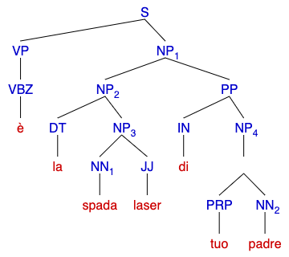
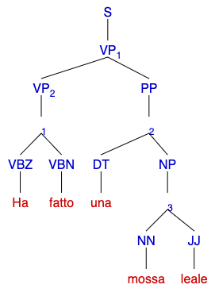
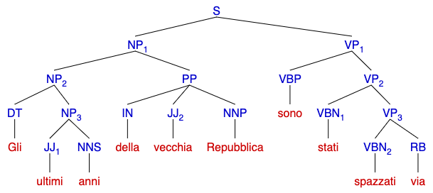
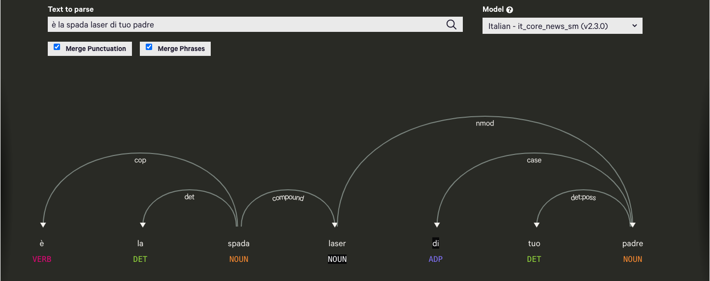
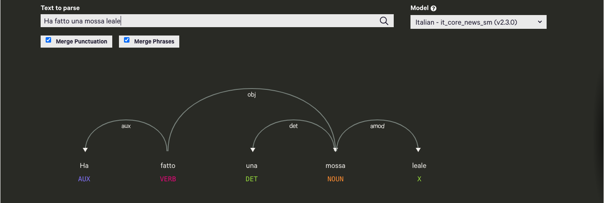
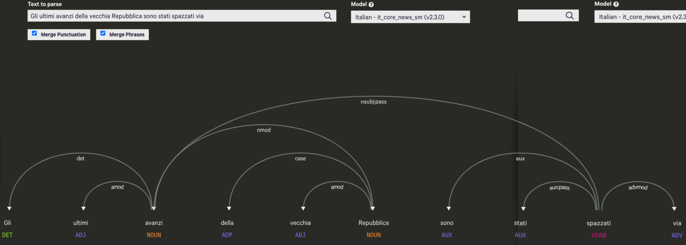

# TLN Part 1 exercise A

## Specifications

The scope of the project is the creation of a translation system from italian english
the exercise is divided into three phases:
- Parse the original sentence in italian to get POS tags and costituents and/or dependencies.
- Translate the lemmas from Italian to English
- Generate the sentence plan
- Realize the translated sentence with SimpleNLG

## Domain analisys and implementations choises
Both costituent and dependency trees possibility have been explored to choose the best one. 
The test sentences provided are:
- è la spada laser di tuo padre
- Ha fatto una mossa leale 
- Gli ultimi avanzi della vecchia Repubblica sono stati spazzati via
  
### Costituency tree
  
For each of the supplied sentence the sintax tree has been manually drawn (http://ironcreek.net/syntaxtree/):

```
[S 
  [VP [VBZ[è]] ] 
  [NP
    [NP [DT[la] ]  
      [NP
        [NN [spada] ] 
        [JJ [laser] ]]] 
  [PP
    [IN [di] ] 
    [NP
      [ [PRP[tuo]] [NN[padre]] ]]]]]
```

```
[S 
  [VP
    [ VP
      [[VBZ[Ha]] 
      [VBN[fatto]]] ] 
  [PP
     [DT[una]
     [NP
       [NN[mossa] 
        JJ[leale]]]]]]]
```

```
[S 
  [NP
    [NP[DT[Gli]] 
     [NP
       [JJ[ultimi] ]
       [NNS[anni]]]] 
     [PP
      [IN[della]] 
      [JJ[vecchia]] 
      [NNP[Repubblica]]]]
  [VP
    [VBP[sono]]
    [VP 
      [VBN[stati]] 
        [VP[VBN[spazzati]] 
        [RB[via]]]]]]

```
on these tree a toy grammar has been written:

```
 S -> VP NP         
 S -> NP PP
 S -> NP VP
 S -> VP
 NP -> DT NN JJ
 NP -> DT JJ NN
 NP -> DT JJ NNS
 NP -> PRP NN
 NP -> NP PP
 NP -> DT PRP
 VP -> VBZ
 VP -> VBZ VBN
 VP -> VBP VP
 VP -> VBN VP
 VP -> VBN RB

 PP -> IN NP
 PP -> DT NP
 PP -> IN JJ NNP 

 DT -> 'il' | 'lo' |'la' | 'i' | 'gli' | 'le' | 'un' | 'uno' | 'una'

IN -> 'a' | 'di' | 'da' | 'in' | 'con' | 'su' | 'per' | 'tra' | 'fa' | 'dei' | 'dello' | 'della' | 'delle'

DD -> 'questo' | 'questa' | 'questi' | 'queste'

PRP -> 'mio' | 'mie'| 'miei'| 'tuo' | 'tue' | 'tua' | 'tuoi' | 'suo' | 'suoi' | 'sua' | 'sue' | 'nostri'| 'nostro' | 'nostre' | 'vostre'| 'vostro' | 'vostri' | 'loro'

VBZ -> 'è' | 'ha'
VBN -> 'fatto' | 'stati' | 'spazzati'
VBP -> 'sono'
RB -> 'via'
NN -> 'spada' | 'padre' | 'mossa'
NNS -> 'anni' | 'avanzi'
NNP -> 'repubblica'
JJ -> 'laser' | 'leale' | 'ultimi' | 'vecchia'
```

### Dependency tree

The dependency tree instead have been automatically drawn using the available online tool displaCy Dependency Visualizer (https://explosion.ai/demos/displacy): 






### Dependency vs costituency conclusion

According to the requirement to translate not only the shown 3 sentences, but also more general sentences a dependency approach is preferable. The hand made costituency tree needs to be retraited for each new sentence type in input so it is very limited. Moreover more data are needed to find the relations between costituents or to infere them somehow, but good linguistic skills are needed for this task.
Some major issues were arising like:
- how to lexilize CFG nodes?
- where to get 'tabelle di percolazione' for the dependencies?
- should be used x-bar theory to project words?
Considering the time critical project and the oveload needed to implement the dependency as costituent+conversion, is a better choise an almost ready to use dependency tree.
So to be coherent with the info just analyzed, the library spaCy has been used, because it's the same of the previously drawn graph.

## Parse and generate english lemmas tree

The result of getting the dependency tree with spaCY has been saved in a dictionary of node adding per each node the english translation of the lemma.
A manual dictionary couldn't fit the need of traducing casual sentences. 
The translation of lemmas has been done using WordNet with the following procedure:
- map all the POS Penn-Wordnet
- get the sysnsets of the italian word with the specific POS.
- solve disambiguation. At first lersk was used but without good results, so the idea is to choose the most frequent synset for the searched word.
- in case the word is missing in wordnet look up in the python Translate dictionary (https://pypi.org/project/translate/1.0.7/)

## Preprocessing

A preprocessing procedure has been develop to handle compound words.
In case of compound dependency the child is merged to the parent and all the children point to the new parent.

## Build the sentence plan

The sentence plan is built recursively exploring the tree with BFS method.
For each node a Phrase or a word is generated and flexed according to the level of the tree (Root or leaf).
Then the phrases are built from the leaves up following the dependency rules.

The general idea is to describe rules and discovering the features for each kind of dependency: obj, amod, aux:pass, nsubj:pass, nsubj, cop etc..

Example of generating a Noun phrase on a noun node
```
      if case('NOUN'):
       phrase = nlg_factory.createNounPhrase()
       phrase.setNoun(node.get_lemma_eng())
       nounSintax = dict(x.split("=")
                         for x in node.get_sintax()[3:].split("|"))
       if nounSintax.get('Number') == 'Plur':
         phrase.setFeature(Feature.NUMBER, NumberAgreement.PLURAL)

```

Example of rule matching 'aux:pass' dependency:
```
        if case('aux:pass'):
          phrase.setFeature(Feature.PASSIVE, True)
```

Some issues arises with particular forms like Genitive Saxon, unknown words (no POS), punctuation or expletive subject that is often needed in english.
Most of these issues have a direct impact on the word order but is also due to unresolved sentence ambiguity at early stage of the process.

There are no intermediate structures, the final result is a sentence plan.

## Postprocessing

Before realizing the sentence some postprocessing is done mainly to:
- get expletive subject
- check punctuation Ex. Question mark

## Results
| Italian                                                            	| English                                                 	|
|--------------------------------------------------------------------	|---------------------------------------------------------	|
| è la spada laser di tuo padre                                      	| It is your father's laser sword.                        	|
| Ha fatto una mossa leale                                           	| It has made a loyal displace.                           	|
| Gli ultimi avanzi della vecchia Repubblica sono stati spazzati via 	| Last excesses of the old democracy have been swept off. 	|
| Paolo ama Francesca                                                	| Paolo loves Francesca.                                  	|
| Paolo ama Francesca?                                               	| Does Paolo love Francesca?                              	|
| Paolo ama Francesca infinitamente                                  	| Paolo loves Francesca Infinitely.                       	|
| Paolo ama Francesca dolcemente                                     	| Paolo loves Francesca sweetly.                          	|
| Lucia corre                                                        	| Lucia rushes.                                           	|
| Lucia corre?                                                       	| Does Lucia rush?                                        	|
| La vita è bella.                                                   	| The life is beautiful.                                  	|
| Il gatto è sul tavolo                                              	| The cat is on the table.                                	|
| Il gatto blu salta sul tavolo agilmente                            	| The blue cat jumps on the table agilely.                	|
| Il gatto di mio cugino salta sul tavolo agilmente                  	| Cat my cousin's jumps on the table agilely.             	|
| Il ricordo di tuo padre è ancora vivo                              	| Remember your father's is I live Inline.                	|
| Marco è stato arrestato                                            	| Mark has been stopped.                                  	|
| Un amico di un mio amico è stato arrestato                         	| Friend my friend's has been stopped.                    	|
| La linguistica computazionale è complicata                         	| Computational linguistic is complicated.                	|
| I diamanti sono molto costosi                                      	| diamonds are expensive much.                            	|
| Il lavoro di Vittorio è stato completato                           	| Work of Vittorio has been finalized.                    	|

### Library

- [NLTK] 
- [SimpleNLG]
- [pySimpleNLG]
- [spaCy]

[NLTK]: <https://www.nltk.org/>
[SimpleNLG]: <https://github.com/simplenlg/simplenlg/wiki>
[pySimpleNLG]: <https://github.com/bjascob/pySimpleNLG>
[SPACY]: <https://spacy.io/>