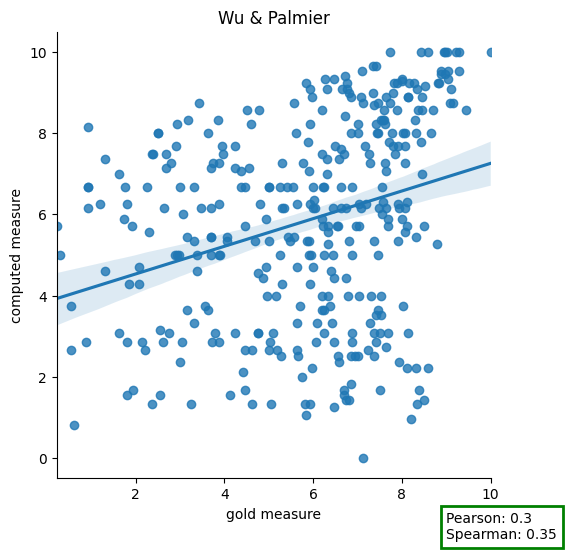
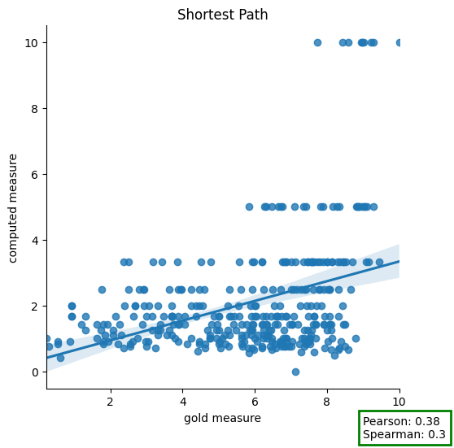

# Task 1

## Concept similarity
Given a file in input with couples of words and golden similarity score, compute the following similarity metrics:
- WU & Palmer
-  Shortest Path
-  Leakcock & Chodorow
Then for each metric compute the Pearson and Spearman correlation indexes versus the golden value.

### Input
WordSim353.csv: contains 353 rows and on each row a couple and a manual annotated golden value.
Ex:
| Word 1 	| Word 2 	| Human (mean) 	|
|--------	|--------	|--------------	|
| love   	| sex    	| 6.77         	|
| tiger  	| cat    	| 7.35         	|
| tiger  	| tiger  	| 10.00        	|

### Output
The script outputs in a single file 'task1_results' a table with the input row enriched with the metrics values:
Ex:
| W1,    | W2,    | WP,    | SP,    | LC,   | GOLD |
|--------|--------|--------|--------|-------|------|
| love,  | sex,   | 9.23,  | 5.00,  | 8.04, | 6.77 |
| tiger, | cat,   | 9.66,  | 5.00,  | 8.04, | 7.35 |
| tiger, | tiger, | 10.00, | 10.00, | 9.93, | 10.0 |

and a table with the Pearson and Spearman values:
| metric, | Pearson,            | Spearman            |
|---------|---------------------|---------------------|
| wp,     | 0.2988152316411566, | 0.34586522018763444 |

## Structure
The scrips is archived in the folder Task_1 and is divided in 3 files:
- main_conceptual_similarity.py: the main code that calls the funcions from the other 2 files
- wn_custom_tools.py contains the implementation of 
  - wu_palmer_metric
  - shortest_path_metric
  - leakcock_chodorow_metric
  - distance (between two synsets)
  - def lowest_common_subsumer(between two synsets)
  - depth_path which measures the depth of a node in all the path in which another node given in input is present
- correlation_indices.py implements pearson_correlation_index and spearman_correlation_index

## Results
The results are in the output folder and are also reported here below for ease of reading.
In the end of the section the are as well some graphical reports no available in the output folder.

### Metrics Table: task1_results.cvs
This file adds to the imput file the column WP, SP, LC containing the values computed by the algorithm

| W1            | W2             | WP    | SP    | LC   | GOLD |
|---------------|----------------|-------|-------|------|------|
| love          | sex            | 9.23  | 5.00  | 8.04 | 6.77 |
| tiger         | cat            | 9.66  | 5.00  | 8.04 | 7.35 |
| tiger         | tiger          | 10.00 | 10.00 | 9.93 | 10.0 |
| book          | paper          | 8.75  | 3.33  | 6.93 | 7.46 |
| computer      | keyboard       | 8.24  | 2.50  | 6.15 | 7.62 |
| computer      | internet       | 6.32  | 1.25  | 4.25 | 7.58 |
| plane         | car            | 7.27  | 1.43  | 4.62 | 5.77 |
| train         | car            | 7.37  | 1.67  | 5.04 | 6.31 |
| telephone     | communication  | 1.67  | 0.91  | 3.38 | 7.5  |
| television    | radio          | 9.09  | 3.33  | 6.93 | 6.77 |
| media         | radio          | 8.24  | 2.50  | 6.15 | 7.42 |
| drug          | abuse          | 1.82  | 1.00  | 3.64 | 6.85 |
| bread         | butter         | 7.50  | 3.33  | 6.93 | 6.19 |
| cucumber      | potato         | 8.24  | 2.50  | 6.15 | 5.92 |
| doctor        | nurse          | 8.24  | 3.33  | 6.93 | 7.0  |
| professor     | doctor         | 6.67  | 1.43  | 4.62 | 6.62 |
| student       | professor      | 5.33  | 1.25  | 4.25 | 6.81 |
| smart         | student        | 1.33  | 0.71  | 2.73 | 4.62 |
| smart         | stupid         | 1.33  | 0.71  | 2.73 | 5.81 |
| company       | stock          | 6.15  | 1.67  | 5.04 | 7.08 |
| stock         | market         | 5.56  | 1.43  | 4.62 | 8.08 |
| stock         | phone          | 7.00  | 1.43  | 4.62 | 1.62 |
| stock         | CD             | 7.37  | 1.67  | 5.04 | 1.31 |
| stock         | jaguar         | 8.15  | 1.67  | 5.04 | 0.92 |
| stock         | egg            | 6.25  | 1.43  | 4.62 | 1.81 |
| fertility     | egg            | 1.54  | 0.83  | 3.15 | 6.69 |
| stock         | live           | 2.86  | 1.67  | 5.04 | 3.73 |
| stock         | life           | 6.15  | 1.67  | 5.04 | 0.92 |
| book          | library        | 8.00  | 3.33  | 6.93 | 7.46 |
| bank          | money          | 5.71  | 1.43  | 4.62 | 8.12 |
| wood          | forest         | 10.00 | 10.00 | 9.93 | 7.73 |
| money         | cash           | 8.75  | 3.33  | 6.93 | 9.15 |
| professor     | cucumber       | 5.00  | 0.77  | 2.93 | 0.31 |
| king          | cabbage        | 5.71  | 1.00  | 3.64 | 0.23 |
| king          | queen          | 10.00 | 10.00 | 9.93 | 8.58 |
| king          | rook           | 9.09  | 3.33  | 6.93 | 5.92 |
| bishop        | rabbi          | 7.50  | 2.00  | 5.54 | 6.69 |
| Jerusalem     | Israel         | 7.00  | 1.43  | 4.62 | 8.46 |
| Jerusalem     | Palestinian    | 2.73  | 0.59  | 2.20 | 7.65 |
| holy          | sex            | 3.08  | 1.00  | 3.64 | 1.62 |
| fuck          | sex            | 8.57  | 3.33  | 6.93 | 9.44 |
| football      | soccer         | 9.52  | 5.00  | 8.04 | 9.03 |
| football      | basketball     | 9.00  | 3.33  | 6.93 | 6.81 |
| football      | tennis         | 7.62  | 1.67  | 5.04 | 6.63 |
| tennis        | racket         | 6.00  | 1.11  | 3.93 | 7.56 |
| Arafat        | peace          | 1.43  | 0.77  | 2.93 | 6.73 |
| Arafat        | terror         | 6.15  | 1.67  | 5.04 | 7.65 |
| Arafat        | Jackson        | 8.00  | 2.50  | 6.15 | 2.5  |
| law           | lawyer         | 1.67  | 0.91  | 3.38 | 8.38 |
| movie         | star           | 5.33  | 1.25  | 4.25 | 7.38 |
| movie         | popcorn        | 3.64  | 0.71  | 2.73 | 6.19 |
| movie         | critic         | 4.44  | 0.91  | 3.38 | 6.73 |
| movie         | theater        | 6.25  | 1.43  | 4.62 | 7.92 |
| physics       | proton         | 2.22  | 0.67  | 2.54 | 8.12 |
| physics       | chemistry      | 9.00  | 3.33  | 6.93 | 7.35 |
| space         | chemistry      | 4.44  | 1.67  | 5.04 | 4.88 |
| alcohol       | chemistry      | 6.67  | 2.00  | 5.54 | 5.54 |
| vodka         | gin            | 8.89  | 3.33  | 6.93 | 8.46 |
| vodka         | brandy         | 8.89  | 3.33  | 6.93 | 8.13 |
| drink         | car            | 2.86  | 0.91  | 3.38 | 3.04 |
| drink         | ear            | 4.62  | 1.25  | 4.25 | 1.31 |
| drink         | mouth          | 5.00  | 1.43  | 4.62 | 5.96 |
| drink         | eat            | 5.00  | 3.33  | 6.93 | 6.87 |
| baby          | mother         | 7.50  | 2.00  | 5.54 | 7.85 |
| drink         | mother         | 6.15  | 1.67  | 5.04 | 2.65 |
| car           | automobile     | 10.00 | 10.00 | 9.93 | 8.94 |
| gem           | jewel          | 10.00 | 10.00 | 9.93 | 8.96 |
| journey       | voyage         | 9.52  | 5.00  | 8.04 | 9.29 |
| boy           | lad            | 9.23  | 5.00  | 8.04 | 8.83 |
| coast         | shore          | 9.09  | 5.00  | 8.04 | 9.1  |
| asylum        | madhouse       | 9.52  | 5.00  | 8.04 | 8.87 |
| magician      | wizard         | 10.00 | 10.00 | 9.93 | 9.02 |
| midday        | noon           | 10.00 | 10.00 | 9.93 | 9.29 |
| furnace       | stove          | 5.26  | 1.00  | 3.64 | 8.79 |
| food          | fruit          | 4.00  | 1.00  | 3.64 | 7.52 |
| bird          | cock           | 9.52  | 5.00  | 8.04 | 7.1  |
| bird          | crane          | 8.70  | 2.50  | 6.15 | 7.38 |
| tool          | implement      | 9.33  | 5.00  | 8.04 | 6.46 |
| brother       | monk           | 9.33  | 5.00  | 8.04 | 6.27 |
| crane         | implement      | 7.50  | 2.00  | 5.54 | 2.69 |
| lad           | brother        | 6.67  | 2.00  | 5.54 | 4.46 |
| journey       | car            | 1.05  | 0.56  | 2.04 | 5.85 |
| monk          | oracle         | 5.33  | 1.25  | 4.25 | 5.0  |
| cemetery      | woodland       | 4.29  | 1.11  | 3.93 | 2.08 |
| food          | rooster        | 2.11  | 0.62  | 2.36 | 4.42 |
| coast         | hill           | 6.67  | 2.00  | 5.54 | 4.38 |
| forest        | graveyard      | 4.29  | 1.11  | 3.93 | 1.85 |
| shore         | woodland       | 6.00  | 2.00  | 5.54 | 3.08 |
| monk          | slave          | 6.67  | 2.00  | 5.54 | 0.92 |
| coast         | forest         | 5.45  | 1.67  | 5.04 | 3.15 |
| lad           | wizard         | 6.67  | 2.00  | 5.54 | 0.92 |
| chord         | smile          | 3.75  | 0.91  | 3.38 | 0.54 |
| glass         | magician       | 4.71  | 1.25  | 4.25 | 2.08 |
| noon          | string         | 2.67  | 0.83  | 3.15 | 0.54 |
| rooster       | voyage         | 0.80  | 0.42  | 1.25 | 0.62 |
| money         | dollar         | 7.78  | 2.00  | 5.54 | 8.42 |
| money         | cash           | 8.75  | 3.33  | 6.93 | 9.08 |
| money         | currency       | 9.33  | 5.00  | 8.04 | 9.04 |
| money         | wealth         | 9.23  | 5.00  | 8.04 | 8.27 |
| money         | property       | 8.33  | 3.33  | 6.93 | 7.57 |
| money         | possession     | 7.27  | 2.50  | 6.15 | 7.29 |
| money         | bank           | 5.71  | 1.43  | 4.62 | 8.5  |
| money         | deposit        | 8.75  | 3.33  | 6.93 | 7.73 |
| money         | withdrawal     | 2.86  | 0.91  | 3.38 | 6.88 |
| money         | laundering     | 2.50  | 0.77  | 2.93 | 5.65 |
| money         | operation      | 3.33  | 1.11  | 3.93 | 3.31 |
| tiger         | jaguar         | 9.33  | 3.33  | 6.93 | 8.0  |
| tiger         | feline         | 9.29  | 3.33  | 6.93 | 8.0  |
| tiger         | carnivore      | 8.89  | 2.50  | 6.15 | 7.08 |
| tiger         | mammal         | 8.00  | 1.67  | 5.04 | 6.85 |
| tiger         | animal         | 8.00  | 2.50  | 6.15 | 7.0  |
| tiger         | organism       | 8.57  | 3.33  | 6.93 | 4.77 |
| tiger         | fauna          | 8.00  | 2.50  | 6.15 | 5.62 |
| tiger         | zoo            | 5.33  | 1.25  | 4.25 | 5.87 |
| psychology    | psychiatry     | 7.27  | 1.43  | 4.62 | 8.08 |
| psychology    | anxiety        | 2.50  | 0.77  | 2.93 | 7.0  |
| psychology    | fear           | 2.50  | 0.77  | 2.93 | 6.85 |
| psychology    | depression     | 3.53  | 0.83  | 3.15 | 7.42 |
| psychology    | clinic         | 2.35  | 0.71  | 2.73 | 6.58 |
| psychology    | doctor         | 3.33  | 0.77  | 2.93 | 6.42 |
| psychology    | Freud          | 0.95  | 0.50  | 1.75 | 8.21 |
| psychology    | mind           | 5.88  | 1.43  | 4.62 | 7.69 |
| psychology    | health         | 2.67  | 0.83  | 3.15 | 7.23 |
| psychology    | science        | 9.41  | 5.00  | 8.04 | 6.71 |
| psychology    | discipline     | 8.75  | 3.33  | 6.93 | 5.58 |
| psychology    | cognition      | 6.15  | 1.67  | 5.04 | 7.48 |
| planet        | star           | 8.57  | 3.33  | 6.93 | 8.45 |
| planet        | constellation  | 7.69  | 2.50  | 6.15 | 8.06 |
| planet        | moon           | 8.00  | 2.50  | 6.15 | 8.08 |
| planet        | sun            | 8.00  | 2.50  | 6.15 | 8.02 |
| planet        | galaxy         | 6.32  | 1.25  | 4.25 | 8.11 |
| planet        | space          | 5.33  | 1.43  | 4.62 | 7.92 |
| planet        | astronomer     | 6.15  | 1.67  | 5.04 | 7.94 |
| precedent     | example        | 9.23  | 5.00  | 8.04 | 5.85 |
| precedent     | information    | 8.33  | 3.33  | 6.93 | 3.85 |
| precedent     | cognition      | 7.27  | 2.50  | 6.15 | 2.81 |
| precedent     | law            | 9.09  | 5.00  | 8.04 | 6.65 |
| precedent     | collection     | 8.00  | 3.33  | 6.93 | 2.5  |
| precedent     | group          | 6.67  | 2.50  | 6.15 | 1.77 |
| precedent     | antecedent     | 6.15  | 1.67  | 5.04 | 6.04 |
| cup           | coffee         | 7.37  | 1.67  | 5.04 | 6.58 |
| cup           | tableware      | 8.89  | 3.33  | 6.93 | 6.85 |
| cup           | article        | 7.50  | 2.00  | 5.54 | 2.4  |
| cup           | artifact       | 7.69  | 2.50  | 6.15 | 2.92 |
| cup           | object         | 5.45  | 1.67  | 5.04 | 3.69 |
| cup           | entity         | 2.86  | 1.67  | 5.04 | 2.15 |
| cup           | drink          | 7.50  | 2.00  | 5.54 | 7.25 |
| cup           | food           | 6.67  | 1.67  | 5.04 | 5.0  |
| cup           | substance      | 5.71  | 1.43  | 4.62 | 1.92 |
| cup           | liquid         | 7.06  | 1.67  | 5.04 | 5.9  |
| jaguar        | cat            | 9.66  | 5.00  | 8.04 | 7.42 |
| jaguar        | car            | 3.33  | 0.59  | 2.20 | 7.27 |
| energy        | secretary      | 2.86  | 0.91  | 3.38 | 1.81 |
| secretary     | senate         | 1.33  | 0.71  | 2.73 | 5.06 |
| energy        | laboratory     | 3.08  | 1.00  | 3.64 | 5.09 |
| computer      | laboratory     | 4.00  | 1.00  | 3.64 | 6.78 |
| weapon        | secret         | 2.86  | 0.91  | 3.38 | 6.06 |
| FBI           | fingerprint    | 2.50  | 0.77  | 2.93 | 6.94 |
| FBI           | investigation  | 2.22  | 0.67  | 2.54 | 8.31 |
| investigation | effort         | 8.24  | 2.50  | 6.15 | 4.59 |
| Mars          | water          | 5.00  | 2.00  | 5.54 | 2.94 |
| Mars          | scientist      | 4.71  | 1.00  | 3.64 | 5.63 |
| news          | report         | 9.23  | 5.00  | 8.04 | 8.16 |
| canyon        | landscape      | 3.53  | 0.83  | 3.15 | 7.53 |
| image         | surface        | 7.14  | 2.00  | 5.54 | 4.56 |
| discovery     | space          | 4.00  | 1.43  | 4.62 | 6.34 |
| water         | seepage        | 2.50  | 0.83  | 3.15 | 6.56 |
| sign          | recess         | 7.50  | 3.33  | 6.93 | 2.38 |
| Wednesday     | news           | 2.67  | 0.83  | 3.15 | 2.22 |
| mile          | kilometer      | 8.00  | 2.50  | 6.15 | 8.66 |
| computer      | news           | 1.67  | 0.91  | 3.38 | 4.47 |
| territory     | surface        | 6.15  | 1.67  | 5.04 | 5.34 |
| atmosphere    | landscape      | 5.00  | 1.11  | 3.93 | 3.69 |
| president     | medal          | 2.35  | 0.77  | 2.93 | 3.0  |
| war           | troops         | 3.08  | 1.00  | 3.64 | 8.13 |
| record        | number         | 9.09  | 5.00  | 8.04 | 6.31 |
| skin          | eye            | 6.67  | 1.67  | 5.04 | 6.22 |
| Japanese      | American       | 7.69  | 2.50  | 6.15 | 6.5  |
| theater       | history        | 5.00  | 1.43  | 4.62 | 3.91 |
| volunteer     | motto          | 1.54  | 0.83  | 3.15 | 2.56 |
| prejudice     | recognition    | 6.67  | 1.67  | 5.04 | 3.0  |
| decoration    | valor          | 2.67  | 0.83  | 3.15 | 5.63 |
| century       | year           | 8.33  | 3.33  | 6.93 | 7.59 |
| century       | nation         | 3.64  | 1.25  | 4.25 | 3.16 |
| delay         | racism         | 6.25  | 1.43  | 4.62 | 1.19 |
| delay         | news           | 5.33  | 1.25  | 4.25 | 3.31 |
| minister      | party          | 6.15  | 1.67  | 5.04 | 6.63 |
| peace         | plan           | 3.08  | 1.00  | 3.64 | 4.75 |
| minority      | peace          | 6.15  | 1.67  | 5.04 | 3.69 |
| attempt       | peace          | 3.08  | 1.00  | 3.64 | 4.25 |
| government    | crisis         | 5.71  | 1.43  | 4.62 | 6.56 |
| deployment    | departure      | 7.14  | 2.00  | 5.54 | 4.25 |
| deployment    | withdrawal     | 7.78  | 2.00  | 5.54 | 5.88 |
| energy        | crisis         | 6.25  | 1.43  | 4.62 | 5.94 |
| announcement  | news           | 6.67  | 2.00  | 5.54 | 7.56 |
| announcement  | effort         | 3.08  | 1.00  | 3.64 | 2.75 |
| stroke        | hospital       | 4.00  | 0.91  | 3.38 | 7.03 |
| disability    | death          | 5.33  | 1.25  | 4.25 | 5.47 |
| victim        | emergency      | 4.44  | 1.00  | 3.64 | 6.47 |
| treatment     | recovery       | 7.69  | 2.50  | 6.15 | 7.91 |
| journal       | association    | 4.00  | 1.43  | 4.62 | 4.97 |
| doctor        | personnel      | 2.67  | 0.83  | 3.15 | 5.0  |
| doctor        | liability      | 2.67  | 0.83  | 3.15 | 5.19 |
| liability     | insurance      | 6.25  | 1.43  | 4.62 | 7.03 |
| school        | center         | 8.75  | 3.33  | 6.93 | 3.44 |
| reason        | hypertension   | 5.56  | 1.11  | 3.93 | 2.31 |
| reason        | criterion      | 5.33  | 1.25  | 4.25 | 5.91 |
| hundred       | percent        | 2.50  | 0.77  | 2.93 | 7.38 |
| Harvard       | Yale           | 8.89  | 3.33  | 6.93 | 8.13 |
| hospital      | infrastructure | 2.67  | 0.83  | 3.15 | 4.63 |
| death         | row            | 5.00  | 1.25  | 4.25 | 5.25 |
| death         | inmate         | 2.86  | 0.91  | 3.38 | 5.03 |
| lawyer        | evidence       | 1.67  | 0.91  | 3.38 | 6.69 |
| life          | death          | 8.57  | 3.33  | 6.93 | 7.88 |
| life          | term           | 8.57  | 3.33  | 6.93 | 4.5  |
| word          | similarity     | 4.55  | 1.11  | 3.93 | 4.75 |
| board         | recommendation | 2.67  | 0.83  | 3.15 | 4.47 |
| governor      | interview      | 1.33  | 0.71  | 2.73 | 3.25 |
| OPEC          | country        | 6.25  | 1.43  | 4.62 | 5.63 |
| peace         | atmosphere     | 7.14  | 2.00  | 5.54 | 3.69 |
| peace         | insurance      | 8.24  | 2.50  | 6.15 | 2.94 |
| territory     | kilometer      | 2.50  | 0.77  | 2.93 | 5.28 |
| travel        | activity       | 6.67  | 1.67  | 5.04 | 5.0  |
| competition   | price          | 5.00  | 1.25  | 4.25 | 6.44 |
| consumer      | confidence     | 1.54  | 0.83  | 3.15 | 4.13 |
| consumer      | energy         | 3.08  | 1.00  | 3.64 | 4.75 |
| problem       | airport        | 1.33  | 0.71  | 2.73 | 2.38 |
| car           | flight         | 5.88  | 1.25  | 4.25 | 4.94 |
| credit        | card           | 6.15  | 1.67  | 5.04 | 8.06 |
| credit        | information    | 7.27  | 2.50  | 6.15 | 5.31 |
| hotel         | reservation    | 3.75  | 0.91  | 3.38 | 8.03 |
| grocery       | money          | 1.33  | 0.71  | 2.73 | 5.94 |
| registration  | arrangement    | 6.67  | 2.00  | 5.54 | 6.0  |
| arrangement   | accommodation  | 6.67  | 1.43  | 4.62 | 5.41 |
| month         | hotel          | 1.54  | 0.83  | 3.15 | 1.81 |
| type          | kind           | 9.47  | 5.00  | 8.04 | 8.97 |
| arrival       | hotel          | 4.71  | 1.00  | 3.64 | 6.0  |
| bed           | closet         | 8.42  | 2.50  | 6.15 | 6.72 |
| closet        | clothes        | 5.88  | 1.25  | 4.25 | 8.0  |
| situation     | conclusion     | 6.25  | 1.43  | 4.62 | 4.81 |
| situation     | isolation      | 7.27  | 2.50  | 6.15 | 3.88 |
| impartiality  | interest       | 4.00  | 1.11  | 3.93 | 5.16 |
| direction     | combination    | 6.67  | 1.43  | 4.62 | 2.25 |
| street        | place          | 6.15  | 1.67  | 5.04 | 6.44 |
| street        | avenue         | 9.47  | 5.00  | 8.04 | 8.88 |
| street        | block          | 6.67  | 1.67  | 5.04 | 6.88 |
| street        | children       | 4.71  | 1.00  | 3.64 | 4.94 |
| listing       | proximity      | 3.16  | 0.77  | 2.93 | 2.56 |
| listing       | category       | 3.75  | 1.11  | 3.93 | 6.38 |
| cell          | phone          | 9.00  | 3.33  | 6.93 | 7.81 |
| production    | hike           | 5.88  | 1.25  | 4.25 | 1.75 |
| benchmark     | index          | 7.69  | 2.50  | 6.15 | 4.25 |
| media         | trading        | 6.25  | 1.43  | 4.62 | 3.88 |
| media         | gain           | 5.00  | 1.43  | 4.62 | 2.88 |
| dividend      | payment        | 8.89  | 3.33  | 6.93 | 7.63 |
| dividend      | calculation    | 2.86  | 0.91  | 3.38 | 6.48 |
| calculation   | computation    | 10.00 | 10.00 | 9.93 | 8.44 |
| currency      | market         | 3.08  | 1.00  | 3.64 | 7.5  |
| OPEC          | oil            | 2.22  | 0.67  | 2.54 | 8.59 |
| oil           | stock          | 5.71  | 1.11  | 3.93 | 6.34 |
| announcement  | production     | 5.00  | 1.43  | 4.62 | 3.38 |
| announcement  | warning        | 6.15  | 1.67  | 5.04 | 6.0  |
| profit        | warning        | 2.86  | 0.91  | 3.38 | 3.88 |
| profit        | loss           | 7.06  | 1.67  | 5.04 | 7.63 |
| dollar        | yen            | 8.00  | 2.50  | 6.15 | 7.78 |
| dollar        | buck           | 10.00 | 10.00 | 9.93 | 9.22 |
| dollar        | profit         | 3.08  | 1.00  | 3.64 | 7.38 |
| dollar        | loss           | 3.33  | 1.11  | 3.93 | 6.09 |
| computer      | software       | 1.43  | 0.77  | 2.93 | 8.5  |
| network       | hardware       | 8.00  | 2.50  | 6.15 | 8.31 |
| phone         | equipment      | 8.75  | 3.33  | 6.93 | 7.13 |
| equipment     | maker          | 5.00  | 1.11  | 3.93 | 5.91 |
| luxury        | car            | 1.25  | 0.67  | 2.54 | 6.47 |
| five          | month          | 4.62  | 1.25  | 4.25 | 3.38 |
| report        | gain           | 3.64  | 1.25  | 4.25 | 3.63 |
| investor      | earning        | 0.00  | 0.00  | 0.00 | 7.13 |
| liquid        | water          | 9.23  | 5.00  | 8.04 | 7.89 |
| baseball      | season         | 2.22  | 0.67  | 2.54 | 5.97 |
| game          | victory        | 5.71  | 1.43  | 4.62 | 7.03 |
| game          | team           | 3.08  | 1.00  | 3.64 | 7.69 |
| marathon      | sprint         | 5.00  | 0.91  | 3.38 | 7.47 |
| game          | series         | 8.57  | 3.33  | 6.93 | 6.19 |
| game          | defeat         | 5.71  | 1.43  | 4.62 | 6.97 |
| seven         | series         | 3.75  | 1.11  | 3.93 | 3.56 |
| seafood       | sea            | 3.64  | 1.25  | 4.25 | 7.47 |
| seafood       | food           | 9.09  | 5.00  | 8.04 | 8.34 |
| seafood       | lobster        | 8.57  | 3.33  | 6.93 | 8.7  |
| lobster       | food           | 7.69  | 2.50  | 6.15 | 7.81 |
| lobster       | wine           | 3.75  | 0.91  | 3.38 | 5.7  |
| food          | preparation    | 5.71  | 1.43  | 4.62 | 6.22 |
| video         | archive        | 5.56  | 1.11  | 3.93 | 6.34 |
| start         | year           | 5.45  | 1.67  | 5.04 | 4.06 |
| start         | match          | 5.71  | 2.50  | 6.15 | 4.47 |
| game          | round          | 8.89  | 3.33  | 6.93 | 5.97 |
| boxing        | round          | 7.27  | 1.43  | 4.62 | 7.61 |
| championship  | tournament     | 8.57  | 3.33  | 6.93 | 8.36 |
| fighting      | defeating      | 2.86  | 0.91  | 3.38 | 7.41 |
| line          | insurance      | 7.14  | 2.00  | 5.54 | 2.69 |
| day           | summer         | 7.69  | 2.50  | 6.15 | 3.94 |
| summer        | drought        | 7.69  | 2.50  | 6.15 | 7.16 |
| summer        | nature         | 3.33  | 1.11  | 3.93 | 5.63 |
| day           | dawn           | 8.33  | 3.33  | 6.93 | 7.53 |
| nature        | environment    | 5.45  | 1.67  | 5.04 | 8.31 |
| environment   | ecology        | 9.23  | 5.00  | 8.04 | 8.81 |
| nature        | man            | 6.67  | 2.50  | 6.15 | 6.25 |
| man           | woman          | 8.33  | 3.33  | 6.93 | 8.3  |
| man           | governor       | 6.67  | 2.00  | 5.54 | 5.25 |
| murder        | manslaughter   | 9.17  | 3.33  | 6.93 | 8.53 |
| soap          | opera          | 2.35  | 0.71  | 2.73 | 7.94 |
| opera         | performance    | 3.08  | 1.00  | 3.64 | 6.88 |
| life          | lesson         | 4.29  | 1.25  | 4.25 | 5.94 |
| focus         | life           | 5.33  | 1.43  | 4.62 | 4.06 |
| production    | crew           | 3.64  | 1.25  | 4.25 | 6.25 |
| television    | film           | 7.78  | 2.00  | 5.54 | 7.72 |
| lover         | quarrel        | 4.00  | 0.77  | 2.93 | 6.19 |
| viewer        | serial         | 5.00  | 0.91  | 3.38 | 2.97 |
| possibility   | girl           | 1.67  | 0.91  | 3.38 | 1.94 |
| population    | development    | 7.27  | 1.43  | 4.62 | 3.75 |
| morality      | importance     | 6.67  | 2.00  | 5.54 | 3.31 |
| morality      | marriage       | 5.45  | 1.67  | 5.04 | 3.69 |
| Mexico        | Brazil         | 8.00  | 2.00  | 5.54 | 7.44 |
| gender        | equality       | 4.62  | 1.25  | 4.25 | 6.41 |
| change        | attitude       | 5.45  | 1.67  | 5.04 | 5.44 |
| family        | planning       | 3.08  | 1.00  | 3.64 | 6.25 |
| opera         | industry       | 2.86  | 0.91  | 3.38 | 2.63 |
| sugar         | approach       | 2.86  | 0.91  | 3.38 | 0.88 |
| practice      | institution    | 8.33  | 3.33  | 6.93 | 3.19 |
| ministry      | culture        | 5.33  | 1.25  | 4.25 | 4.69 |
| problem       | challenge      | 6.15  | 1.67  | 5.04 | 6.75 |
| size          | prominence     | 6.15  | 1.67  | 5.04 | 5.31 |
| country       | citizen        | 4.00  | 1.00  | 3.64 | 7.31 |
| planet        | people         | 2.00  | 1.11  | 3.93 | 5.75 |
| development   | issue          | 7.50  | 2.50  | 6.15 | 3.97 |
| experience    | music          | 6.15  | 1.67  | 5.04 | 3.47 |
| music         | project        | 8.00  | 2.50  | 6.15 | 3.63 |
| glass         | metal          | 5.45  | 1.67  | 5.04 | 5.56 |
| aluminum      | metal          | 9.23  | 5.00  | 8.04 | 7.83 |
| chance        | credibility    | 5.00  | 1.67  | 5.04 | 3.88 |
| exhibit       | memorabilia    | 4.29  | 1.11  | 3.93 | 5.31 |
| concert       | virtuoso       | 1.43  | 0.77  | 2.93 | 6.81 |
| rock          | jazz           | 8.57  | 3.33  | 6.93 | 7.59 |
| museum        | theater        | 6.25  | 1.43  | 4.62 | 7.19 |
| observation   | architecture   | 7.06  | 1.67  | 5.04 | 4.38 |
| space         | world          | 5.71  | 2.00  | 5.54 | 6.53 |
| preservation  | world          | 5.88  | 1.43  | 4.62 | 6.19 |
| admission     | ticket         | 5.71  | 1.43  | 4.62 | 7.69 |
| shower        | thunderstorm   | 7.00  | 1.43  | 4.62 | 6.31 |
| shower        | flood          | 6.36  | 2.00  | 5.54 | 6.03 |
| weather       | forecast       | 1.33  | 0.71  | 2.73 | 8.34 |
| disaster      | area           | 5.00  | 1.11  | 3.93 | 6.25 |
| governor      | office         | 5.26  | 1.00  | 3.64 | 6.34 |
| architecture  | century        | 3.08  | 1.00  | 3.64 | 3.78 |

### Correlation index table: task1_results.cvs

| metric | Pearson             | Spearman            |
|--------|---------------------|---------------------|
| wp     | 0.2988152316411566  | 0.34586522018763444 |
| sp     | 0.37649415920337187 | 0.2975133709235656  |
| lc     | 0.3289952313631554  | 0.2975133709235656  |

The following charts were plotter using the above data and adding the regression model:




# Task 2 

## Word Sense Disambiguation
This script performs 2 tasks:
- Given an input file, disambiguate the words surrounded by chars '**' and replace with all lemmas of disambiguated sens
- Given a random list of 50 sentences from SemCor corpus disambiguate 1 lemma and verify accuracy versus the golden SemCor annotation

### Input
The input for the first part is th file in 'input' folder named sentences.txt and it is composed by sentences like:
'- She packed her **lunch** in her purse.'

The input for the second part is instead random and computed by the function:
```python
def get_random_sent_goldsyn_brown(quantity):
    sents = semcor.xml('brown2/tagfiles/br-n12.xml').findall('context/p/s')
    # prepare the ranges for the random function
    random_index2explore = list(range(0, len(sents)-1))
    results = []
    # add sentences to the result till the required quantity is reached, or the dataset has no more sentences
    while len(results) < quantity and len(random_index2explore) > 0:
        # choose a random index not previously
        index = choice(random_index2explore)
        random_index2explore.remove(index)
        raw_sent = ''
        # a list of tuple like (word, goldSynset) to choose from
        sent_noun_list = []
        for wordform in sents[index]:
            raw_sent += ' ' + wordform.text
            lemma = wordform.get('lemma')
            lexsn = wordform.get('lexsn')
            wnsn = wordform.get('wnsn')
            if wordform.get('pos') == 'NN' and lemma is not None and lexsn is not None and wnsn != '0' and '_' not in wordform.text:
                sent_noun_list.append(
                    (wordform.text, lexsnKey2Syn(f'{lemma}%{lexsn}')))
        # if the analyzed sentence has nouns one is randomly chosed and assigner to the return sentence
        if len(sent_noun_list) > 0:
            random_gold_syn = random.choice(sent_noun_list)
            results.append((random_gold_syn[1], random_gold_syn[0], raw_sent))
    return results
  ```
the synset are retrieved from the corpus by their Sense Key Encoding (Ex: person%1:03:00::) by the function:
  ```python
def lexsnKey2Syn(sensekey): 
            return wn.lemma_from_key(sensekey).synset()
  ```

### Output
The script outputs 2 files located in output folder:
- task2_WSD_results.csv for the results of the senses<->lemma replacement part
- task2_SemCor_results for the result of the SemCor sentences wds

## Structure
The scrips is archived in the folder Task_2 and is only 1 file 'main_wsd.py' which includes the main, the lesk implementation and the algorithm to withdraw the SemCor sentences

## Results
The results are in the output folder and are also reported here below for ease of reading.
In the end of the section the are as well some graphical reports no available in the output folder.
For both the first part and the second the results shown a good success rate of about 70%

task2_WSD_results.csv:
| ID | Type | Value |
|-|-|-|
| 0 | Sentence |  **Arms** bend at the elbow.'] |
|  | tagged word | arm |
|  | Lesk syn | arm.n.01': a human limb; technically the part of the superior limb   between the shoulder and the elbow but commonly used to refer to the whole   superior limb |
|  | Sentence_final |  ['arm'] bend at the elbow. |
| 1 | Sentence |  Germany sells **arms** to Saudi   Arabia.'] |
|  | tagged word | arms  |
|  | Lesk syn | weaponry.n.01': weapons considered collectively |
|  | Sentence_final |  Germany sells ['weaponry', 'arms',   'implements_of_war', 'weapons_system', 'munition'] to Saudi Arabia. |
| 2 | Sentence |  The **key** broke in the lock.'] |
|  | tagged word | key  |
|  | Lesk syn | key.n.01': metal device shaped in such a way that when it is inserted   into the appropriate lock the lock's mechanism can be rotated |
|  | Sentence_final |  The ['key'] broke in the lock. |
| 3 | Sentence |  The **key** problem was not one of   quality but of quantity. '] |
|  | tagged word | key  |
|  | Lesk syn | key.n.02': something crucial for explaining |
|  | Sentence_final |  The ['key'] problem was not one of   quality but of quantity.  |
| 4 | Sentence |  Work out the **solution** in your   head.'] |
|  | tagged word | solution  |
|  | Lesk syn | solution.n.01': a homogeneous mixture of two or more substances;   frequently  |
|  | Sentence_final |  Work out the ['solution'] in your   head. |
| 5 | Sentence |  Heat the **solution** to 75°   Celsius. '] |
|  | tagged word | solution  |
|  | Lesk syn | solution.n.01': a homogeneous mixture of two or more substances;   frequently  |
|  | Sentence_final |  Heat the ['solution'] to 75°   Celsius.  |
| 6 | Sentence |  The house was burnt to **ashes**   while the owner returned.'] |
|  | tagged word | ashes  |
|  | Lesk syn | ash.n.01': the residue that remains when something is burned |
|  | Sentence_final |  The house was burnt to ['ash']   while the owner returned. |
| 7 | Sentence |  This table is made of **ash**   wood.'] |
|  | tagged word | ash  |
|  | Lesk syn | ash.n.03': strong elastic wood of any of various ash trees; used for   furniture and tool handles and sporting goods such as baseball bats |
|  | Sentence_final |  This table is made of ['ash']   wood. |
| 8 | Sentence |  The **lunch** with her boss took   longer than she expected. '] |
|  | tagged word | lunch  |
|  | Lesk syn | lunch.n.01': a midday meal |
|  | Sentence_final |  The ['lunch', 'luncheon',   'tiffin', 'dejeuner'] with her boss took longer than she expected.  |
| 9 | Sentence |  She packed her **lunch** in her   purse.'] |
|  | tagged word | lunch  |
|  | Lesk syn | lunch.n.01': a midday meal |
|  | Sentence_final |  She packed her ['lunch',   'luncheon', 'tiffin', 'dejeuner'] in her purse. |
| 10 | Sentence |  The **classification** of the   genetic data took two years.'] |
|  | tagged word | classification  |
|  | Lesk syn | categorization.n.03': the act of distributing things into classes or   categories of the same type |
|  | Sentence_final |  The ['categorization',   'categorisation', 'classification', 'compartmentalization',   'compartmentalisation', 'assortment'] of the genetic data took two years. |
| 11 | Sentence |  The journal Science published the   **classification** this month.'] |
|  | tagged word | classification  |
|  | Lesk syn | categorization.n.03': the act of distributing things into classes or   categories of the same type |
|  | Sentence_final |  The journal Science published the   ['categorization', 'categorisation', 'classification',   'compartmentalization', 'compartmentalisation', 'assortment'] this month. |
| 12 | Sentence |  His cottage is near a small   **wood**.'] |
|  | tagged word | wood  |
|  | Lesk syn | wood.n.01': the hard fibrous lignified substance under the bark of trees |
|  | Sentence_final |  His cottage is near a small   ['wood'] . |
| 13 | Sentence |  The statue was made out of a block   of **wood**.'] |
|  | tagged word | wood  |
|  | Lesk syn | wood.n.08': a golf club with a long shaft used to hit long shots;   originally made with a wooden head |
|  | Sentence_final |  The statue was made out of a block   of ['wood'] . |


task2_SemCor_results

| id | Sentence | Lemma | lesk synset | gold synset | score |
|-|-|-|-|-|-|
| 1 | He started to reach for his gun , but apparently hammer it . | gun | gun.n.07 | gun.n.01 | 0 |
| 2 | `` We 'll do it another way , then '' , he said harshly . | way | way.n.06 | manner.n.01 | 0 |
| 3 | He backed Jess into a corner , grabbed a handful of the man 's shirtfront   , and drew_back his right fist . | corner | corner.n.01 | corner.n.03 | 0 |
| 4 | Curt caught him flush on the nose with a blow which started at the floor   . | floor | floor.n.01 | floor.n.01 | 1 |
| 5 | `` One thing , Summers '' , Brenner said . | thing | thing.n.01 | thing.n.10 | 0 |
| 6 | When his head came_down , Curt grabbed him by the hair and catapulted him   head first into the wall . | head | head.n.01 | head.n.01 | 1 |
| 7 | `` Damn you , Adams '' - Jess was beginning to recover from his initial   shock . | shock | daze.n.01 | daze.n.01 | 1 |
| 8 | `` You and I have a little talking to do , Jess . | talking | talk.n.01 | talk.n.01 | 1 |
| 9 | You 're the kind of bastard who sneaks_up on a man from behind and hits   him with a club . | man | man.n.03 | man.n.01 | 0 |
| 10 | There were two horses in the barn , a sway-backed dun and Jess_Crouch 's   buckskin . | horses | knight.n.02 | horse.n.01 | 0 |
| 11 | He could hear horses moving around inside , and nothing else . | horses | horse.n.01 | horse.n.01 | 1 |
| 12 | Again he stood in the darkness listening , but there was only the scrape   of a shod hoof on a plank floor . | plank | board.n.02 | board.n.02 | 1 |
| 13 | Vastly relieved , Summers nodded and started toward the door . | door | door.n.01 | doorway.n.01 | 0 |
| 14 | It was like hitting a sack of salt . | salt | salt.n.01 | salt.n.02 | 0 |
| 15 | Even Black 's old crowbait began to snort , and from the house Black   yelled , `` Jess ! | crowbait | crowbait.n.01 | crowbait.n.01 | 1 |
| 16 | He let_go_of the shirt , and Jess slumped to the floor . | floor | floor.n.01 | floor.n.01 | 1 |
| 17 | Presently he heard footsteps crossing the yard , and Jess 's smothered   curses . | yard | yard.n.02 | yard.n.02 | 1 |
| 18 | There was a light in Black 's front_room , but drawn curtains prevented   any view of the interior . | interior | inside.n.01 | inside.n.01 | 1 |
| 19 | He moved up and lifted Jess 's pistol out of its holster . | pistol | pistol.n.01 | pistol.n.01 | 1 |
| 20 | He slammed into the wall , bounced back , and caught Curt with a   roundhouse right which sent him spinning . | wall | wall.n.04 | wall.n.01 | 0 |
| 21 | Horse smell was very strong , and he could hear the crunch of grain being   ground between strong jaws . | grain | grain.n.01 | grain.n.02 | 0 |
| 22 | I just want you to take a message to Diane_Molinari . | message | message.n.01 | message.n.01 | 1 |
| 23 | He moved ahead carefully , his left_hand in_front of him , and came to a   wooden partition . | partition | partition.n.01 | partition.n.01 | 1 |
| 24 | As it was , his vision blurred and for a moment he was unable to move . | vision | vision.n.01 | sight.n.03 | 0 |
| 25 | The horse continued to snort . | horse | cavalry.n.01 | horse.n.01 | 0 |
| 26 | `` It was Brenner 's idea '' , Jess mumbled , dabbing at his nose . | nose | nose.n.01 | nose.n.01 | 1 |
| 27 | An inch lower and it would have knocked him out . | inch | inch.n.01 | inch.n.01 | 1 |
| 28 | The tines broke_off under Jess 's twisting , and he swung the handle in   an attempt to knock Curt 's brains out . | handle | handle.n.01 | handle.n.01 | 1 |
| 29 | Blood gushed from his nose , and he backed_off as rapidly as he could ,   stumbling over his own feet in his frantic haste to get_away from Curt 's   fists . | Blood | blood.n.01 | blood.n.01 | 1 |
| 30 | `` No . | No | no.n.01 | no.n.01 | 1 |
| 31 | Curt approached the place cautiously , and watched it several minutes   from the protection of a grove of trees . | protection | protection.n.01 | protective_covering.n.01 | 0 |
| 32 | `` We 're going to Marshal_Woods 's house . | house | house.n.01 | house.n.01 | 1 |
| 33 | `` That 's the stuff '' , Curt said . | stuff | material.n.01 | stuff.n.05 | 0 |
| 34 | He had found Curt 's weakness , or what to Jess was a weakness , and was   smart enough to take_advantage of it . | weakness | helplessness.n.01 | failing.n.01 | 0 |
| 35 | He reached_out to pull the door shut and fasten it with a sliding bolt . | door | door.n.01 | door.n.01 | 1 |
| 36 | Now turn_around so I can see your face '' . | face | face.n.01 | face.n.01 | 1 |
| 37 | Reaching across the side of the stall , he slapped the buckskin on the   rump . | side | side.n.01 | side.n.01 | 1 |
| 38 | `` It does n't seem quite right , telling her a thing like that . | thing | thing.n.09 | thing.n.07 | 0 |
| 39 | Apparently sensing this , and realizing that it gave him an advantage ,   Jess became bold . | advantage | advantage.n.01 | advantage.n.01 | 1 |
| 40 | Jess 's coarse features twisted in a surprised grin which was smashed out   of shape by Curt 's fist . | grin | smile.n.01 | smile.n.01 | 1 |
| 41 | As Curt had hoped , the house door banged open . | door | door.n.01 | door.n.01 | 1 |
| 42 | Curt 's fingers put a_little more pressure on the trigger of his gun . | trigger | gun_trigger.n.01 | gun_trigger.n.01 | 1 |
| 43 | Could n't I just '' - His voice trailed off into silence . | silence | silence.n.01 | silence.n.02 | 0 |
| 44 | His face pale , Summers headed for the street . | face | face.n.01 | face.n.01 | 1 |
| 45 | He started toward the stairway , then turned to add , `` Tell her to come   to Adams 's room , that Adams is in_trouble . | stairway | stairway.n.01 | stairway.n.01 | 1 |
| 46 | Curt 's visit to the livery_stable had been merely a precaution in_case   anyone should be watching . | visit | visit.n.01 | visit.n.01 | 1 |
| 47 | About now he 's probably having supper . | supper | supper.n.01 | supper.n.01 | 1 |
| 48 | That long ride the four of you took must 've given him a good appetite . | appetite | appetite.n.01 | appetite.n.01 | 1 |
| 49 | When his eyes began to focus , he saw Jess charging at him with a   pitchfork . | pitchfork | pitchfork.n.01 | pitchfork.n.01 | 1 |
| 50 | Sweat bubbled out on Jess 's swarthy face . | face | face.n.01 | face.n.01 | 1 |
|  |  |  |  | TOTALE | 33/50 (66%) |


## Authors

- Vittorio Paragallo